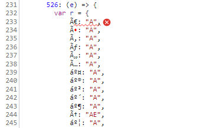

## Usage

Install the dependencies:
> yarn

Build the development version:
> yarn dev

Open the `index.html` file in a browser, e.g. Google Chrome.

Open the developer console of the browser: no error message.

Build production version:
> yarn prod

Reload the opened `index.html` file in the browser.

Check the developer console of the browser: error message (`Uncaught SyntaxError: Invalid or unexpected token`)

## Explanation

The `match-sorter` dependency includes a dependency called `remove-accents`, that maps characters with a [diacritic](https://en.wikipedia.org/wiki/Diacritic) to a character without a diacritic, e.g. `À` to `A`. This dependency is used in the `match-sorter` dependency to remove accents from strings before sorting them.

The original code is similar to this:

```js
var characterMap = {
	"À": "A",
	"Á": "A",
	"Â": "A",
	"Ã": "A",
	"Ä": "A",
  // ...
};
```

During the production build process (enabled by `config.mode === "production"`), webpack minifies the code. This results in the following code:

```js
// prettified for readability
var r = {
  // notice the missing quotes around the keys
	À: "A",
	Á: "A",
	Â: "A",
	Ã: "A",
	Ä: "A",
  // ...
};
```

The browser interprets this as a syntax error, because the keys are not quoted. This is not a problem in development mode, because the code is not minified and the quotes aren't removed. When we take a look at the source code in the browser, the code looks like this:



The result: `Uncaught SyntaxError: Invalid or unexpected token (at main.js:233:14)`.
As soon as we put the key in quotes, the error is gone.

In short: the minifier shouldn't remove the quotes from characters that have a diacritic.
